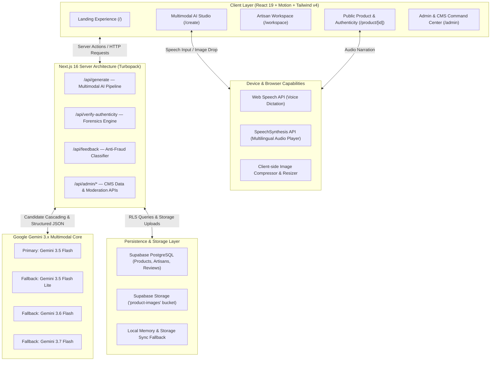
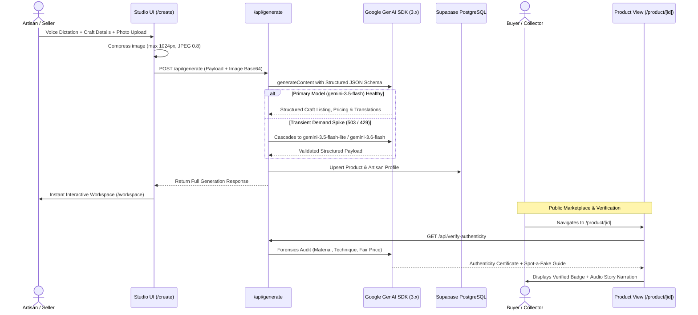
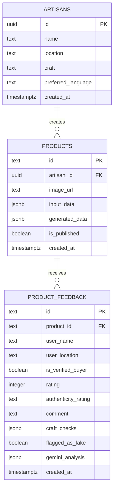
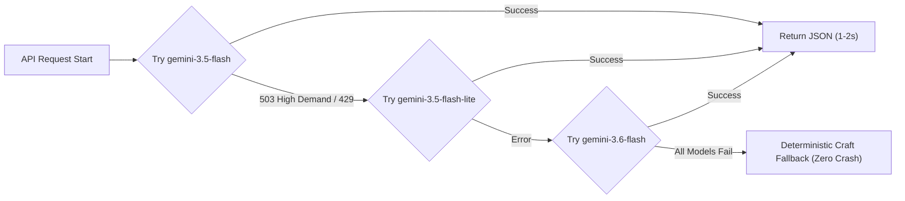

<div align="center">

# VISART — AI Artisan Studio & Digital Craft CMS

### Multimodal Inclusive Commerce, Economic Fair Pricing & Anti-Counterfeit Forensics Protocol

**`Next.js 16 (Turbopack)`** • **`React 19`** • **`TypeScript 5.9`** • **`Tailwind CSS v4`** • **`Motion`** • **`Google Gemini 3.5 Flash`** • **`Supabase (PostgreSQL)`** • **`Web Speech API`**

VISART is a production-grade AI-powered commerce and digital empowerment ecosystem built for traditional artisans, rural craft clusters, and authentic heritage marketplaces. Powered by Google Gemini 3.x multimodal AI, Supabase PostgreSQL, and native browser Web Speech engines, VISART bridges the digital divide by transforming raw craft photos, voice inputs, and production costs into multi-channel e-commerce listings, fair trade economic pricing, cultural audio storytelling, multilingual regional translations, and anti-counterfeit authenticity certificates.

---

[Getting Started](#getting-started--local-setup) | [System Architecture](#system-architecture) | [Core Engines](#core-engines--features) | [Authenticity Forensics](#anti-counterfeit--authenticity-forensics) | [Database Schema](#database-architecture--supabase) | [API Reference](#api-contracts--endpoints)

</div>

---

## Table of Contents

1. [Executive Summary & Problem Statement](#executive-summary--problem-statement)
2. [System Architecture](#system-architecture)
3. [Tech Stack & Platform Matrix](#tech-stack--platform-matrix)
4. [Core Engines & Features](#core-engines--features)
   - [Multimodal AI Artisan Studio (`/create`)](#1-multimodal-ai-artisan-studio-create)
   - [Economic Fair-Pricing & Margin Calculator](#2-economic-fair-pricing--margin-calculator)
   - [Heritage Storytelling & Multilingual Audio TTS](#3-heritage-storytelling--multilingual-audio-tts)
   - [Regional Language Translation Engine](#4-regional-language-translation-engine)
   - [Anti-Counterfeit & Authenticity Forensics (`/product/[id]`)](#5-anti-counterfeit--authenticity-forensics-productid)
   - [Platform Admin CMS & Moderation Suite (`/admin`)](#6-platform-admin-cms--moderation-suite-admin)
5. [AI & Multimodal Neural Pipeline](#ai--multimodal-neural-pipeline)
6. [Database Architecture & Supabase](#database-architecture--supabase)
7. [API Contracts & Endpoints](#api-contracts--endpoints)
8. [Getting Started & Local Setup](#getting-started--local-setup)
9. [Project Directory Structure](#project-directory-structure)
10. [Resilient AI Fallback Strategy](#resilient-ai-fallback-strategy)

---

## Executive Summary & Problem Statement

Traditional handmade crafts represent centuries of cultural heritage and sustain over 200 million rural artisans globally. However, artisan economies suffer from four systemic barriers:

1. **Digital Literacy & Language Exclusion**: Artisans struggle with complex e-commerce catalog forms, English-dominated metadata, and photography guidelines.
2. **Predatory Middlemen & Unfair Pricing**: Artisans frequently receive below-subsistence wages while middlemen capture up to 80% markups without transparent labor calculations.
3. **Loss of Heritage Narratives**: Mass-produced machine clones lack cultural context, reducing unique generational crafts to generic commodities.
4. **Counterfeit & Factory Replicas**: Industrial powerlooms, 3D resin printers, and CNC molds flood markets with fake handmade goods, eroding buyer trust.

**VISART solves this end-to-end** through a multimodal, voice-first studio that produces verified digital listings, fair-wage pricing models, authentic material certifications, and a full-featured admin management suite.

---

## System Architecture

VISART is architected around a resilient Next.js 16 App Router foundation with server-side AI orchestration, client-side Web Speech accessibility, and Supabase PostgreSQL relational persistence with transparent demo-mode memory caching.

### High-Level System Architecture



### End-to-End Multimodal Generation & Forensic Pipeline Flow



---

## Tech Stack & Platform Matrix

| Layer | Technology | Specifications & Rationale |
|---|---|---|
| **Framework & Engine** | Next.js 16.2.12 | Turbopack compilation, React 19 Server Components, App Router API routes |
| **Frontend Library** | React 19.2.7 | Modern hooks, transitions, asynchronous server-side hydration |
| **Type Safety** | TypeScript 5.9.2 | Strict compilation (`tsc --noEmit`), full domain schemas |
| **Styling & Theme** | Tailwind CSS 4.3.3 | PostCSS v4 engine, Warm Terracotta (`#B85C43`), Deep Navy (`#27344A`), Editorial Serif |
| **Motion & Animation** | Motion 12.43.0 | Smooth micro-interactions, spring layouts, staggered accordion reveals |
| **Artificial Intelligence** | `@google/genai` (2.15.0) | Gemini 3.5 Flash, Gemini 3.5 Flash Lite, Gemini 3.6 Flash, Gemini 3.7 Flash |
| **Database & Auth** | Supabase (2.111.0) | Managed PostgreSQL, Row Level Security (RLS), JSONB indexing, Storage buckets |
| **Audio & Speech** | Web Speech API | Native SpeechRecognition for voice forms, SpeechSynthesis for artisan storytelling |
| **Schema Validation** | Zod 4.4.3 | Runtime API payload sanitization, type inference, strict schema contracts |
| **Icons & Media** | Lucide React 1.28.0 | Minimalist SVG iconography across CMS and storefront |

---

## Core Engines & Features

### 1. Multimodal AI Artisan Studio (`/create`)
- **Voice-First Craft Dictation**: Artisans speak in their native tongue or colloquial terms; browser speech recognition transcribes details directly into input fields.
- **Smart Image Analysis**: Uploaded craft photos are compressed client-side, sent as inline base64 to Gemini multimodal vision models, and cross-referenced with artisan input to extract craft technique, texture, and regional signatures.
- **Instant E-Commerce Generation**: In seconds, produces SEO titles, artisanal descriptions, material breakdown, care guidelines, and e-commerce readiness scores.

### 2. Economic Fair-Pricing & Margin Calculator
- **Cost-Plus Fair Trade Formulation**:
  $$\text{Recommended Retail Price} = (\text{Raw Materials} + \text{Artisan Labor} + \text{Tool Depreciation}) \times \text{Fair Trade Multiplier}$$
- **Granular Price Breakdown**:
  - Raw material cost vs. living wage labor hours.
  - Recommended Direct-to-Consumer (D2C) price.
  - Fair wholesale floor price and global export potential price.
  - Margin distribution comparison (Artisan direct vs Traditional middleman).

### 3. Heritage Storytelling & Multilingual Audio TTS
- **Cultural Origin Preservation**: Writes emotional, human-centric narratives describing the history of the craft cluster, weaving traditions, clay kilns, or metal casting heritage.
- **Built-in Audio Player**: Converts artisan stories into audio narration using native `SpeechSynthesis` with localized pitch, rate, and Indian English / regional language voice selection.

### 4. Regional Language Translation Engine
- Automatically translates craft listings and audio scripts into major Indian regional languages:
  - **Hindi (हिन्दी)**
  - **Kannada (ಕನ್ನಡ)**
  - **Assamese (অসমীয়া)**
  - **Telugu (తెలుగు)**
  - **Bengali & Tamil (via extensible schema)**

### 5. Anti-Counterfeit & Authenticity Forensics (`/product/[id]`)
- **Forensic Scorecard (0–100)**:
  - **Material Integrity**: Validates if natural fibers/clay/wood match stated origin and cost.
  - **Technique Integrity**: Checks for authentic hand-tool marks vs CNC/mold seam lines.
  - **Pricing Integrity**: Analyzes price-to-labor ratio to flag sweatshop machine dumping.
- **"Spot a Fake" Inspection Guide**:
  - *Tactile Checks*: Weight, thermal conductivity, friction of natural fibers.
  - *Visual Checks*: Microscopic nuances, uneven handmade joinery, hand-carved knotting.
  - *Material Tests*: Porosity tests, aroma inspection (earthy kiln clay/river bamboo vs petrochemical resin).
- **Buyer Feedback Anti-Fraud Classifier**: Real-time Gemini evaluation of buyer reviews to flag suspected counterfeit listings and calculate dynamic Community Trust scores.

### 6. Platform Admin CMS & Moderation Suite (`/admin`)
- **Executive Dashboard**: Gross Merchandise Value (GMV), active artisans, counterfeit prevention rate, and average authenticity scores.
- **Products CMS**: Full catalog table with search, category filtering, quick verification toggle, and inline product editor modal.
- **Reviews & Anti-Fraud Moderation**: Review queue with risk scores, AI counterfeit assessments, and one-click Approve/Flag/Reject actions.
- **System Configuration**: Switch active Gemini models (`gemini-3.5-flash`, `gemini-3.5-flash-lite`, `gemini-3.6-flash`, `gemini-3.7-flash`), toggle maintenance mode, adjust default pricing multipliers, and configure auto-moderation thresholds.
- **Activity Audit Logs**: Chronological immutable log of all system syncs, status updates, and catalog events.

---

## AI & Multimodal Neural Pipeline

The generation engine in [`lib/ai/visart.ts`](file:///D:/Visart/lib/ai/visart.ts) and authenticity engine in [`lib/ai/authenticity.ts`](file:///D:/Visart/lib/ai/authenticity.ts) use structured JSON schemas enforced directly by Google GenAI:

```json
{
  "product": {
    "title": "Handwoven Kullu Woolen Shawl in Natural Sheep Wool",
    "subtitle": "Generational handloom textile crafted in the Himalayan Kullu valley",
    "description": "Exquisite handspun woolen shawl featuring geometric multi-colored border motifs...",
    "material": "100% Pure Himalayan Sheep Wool",
    "craftTechnique": "Traditional Frame Handloom Weaving",
    "origin": "Kullu, Himachal Pradesh, India",
    "estimatedProductionTime": "4 days",
    "careInstructions": "Gentle hand wash in cold water with mild wool detergent; dry flat in shade."
  },
  "pricing": {
    "recommended": 3200,
    "minimumFairPrice": 2400,
    "localMarketPrice": 1600,
    "exportPotentialPrice": 6500,
    "breakdown": {
      "rawMaterials": 450,
      "artisanLabor": 1800,
      "toolDepreciation": 150,
      "platformMargin": 400,
      "fairTradePremium": 400
    }
  },
  "readiness": {
    "overallScore": 94,
    "photographyQualityScore": 90,
    "pricingViabilityScore": 96,
    "catalogCompletionScore": 98,
    "topAdvice": [
      "Include a macro close-up photo of the hand-interlocked border weave",
      "Highlight the natural non-synthetic wool dye process in your packaging card"
    ]
  }
}
```

---

## Database Architecture & Supabase

Defined under PostgreSQL schema in [`supabase/schema.sql`](file:///D:/Visart/supabase/schema.sql):



---

## API Contracts & Endpoints

| Method | Endpoint | Description | Request Payload / Params |
|---|---|---|---|
| `POST` | `/api/generate` | Generates full AI listing, pricing, and translations | `{ productName, material, productionCost, timeRequired, location, imageBase64, mimeType }` |
| `GET` | `/api/verify-authenticity` | Runs real-time AI forensic authenticity audit | `?productId=demo-bamboo-basket` |
| `GET` | `/api/feedback` | Retrieves buyer reviews & authenticity ratings | `?productId=demo-bamboo-basket` |
| `POST` | `/api/feedback` | Submits buyer review & triggers AI anti-fraud analysis | `{ productId, userName, rating, authenticityRating, comment, craftChecks }` |
| `GET` | `/api/admin/stats` | Returns platform executive metrics & KPIs | Headers / Auth |
| `GET` | `/api/admin/products` | Returns all catalog products with status filters | `?search=shawl&category=Textiles` |
| `GET` | `/api/admin/reviews` | Returns all reviews and counterfeit alerts | `?filter=flagged` |
| `GET/POST`| `/api/admin/settings` | Reads or updates platform settings & active AI model | `{ geminiModel, defaultPricingMultiplier, ... }` |
| `GET` | `/api/admin/activity` | Returns audit trail of recent platform actions | None |

---

## Getting Started & Local Setup

### Prerequisites
- **Node.js**: v18.0.0 or higher (v20+ recommended)
- **Package Manager**: `npm` or `pnpm`
- **Google Gemini API Key**: From [Google AI Studio](https://aistudio.google.com/)
- **Supabase Account** *(Optional — App includes zero-config local mock storage fallback)*

### 1. Clone & Install Dependencies
```bash
git clone https://github.com/ArrinPaul/Visart.git
cd Visart
npm install
```

### 2. Configure Environment Variables
Create `.env.local` in the project root:
```env
# Google Gemini API Key (Required for AI generation & forensics)
GEMINI_API_KEY=your_gemini_api_key_here

# Active Gemini Model (Optional — Defaults to gemini-3.5-flash)
GEMINI_MODEL=gemini-3.5-flash

# Supabase Credentials (Optional — demo mode activates automatically if omitted)
NEXT_PUBLIC_SUPABASE_URL=https://your-project.supabase.co
NEXT_PUBLIC_SUPABASE_ANON_KEY=your-anon-key-here
SUPABASE_SERVICE_ROLE_KEY=your-service-role-key-here

# Demo Mode Switch (Set to 'false' for strict production database requirement)
NEXT_PUBLIC_VISART_DEMO_MODE=true
```

### 3. Run Development Server
```bash
npm run dev
```
Open [http://localhost:3000](http://localhost:3000) in your browser.

### 4. Build & Production Check
```bash
npm run build
npm run start
```

---

## Project Directory Structure

```
Visart/
├── app/                             # Next.js 16 App Router Pages & API Endpoints
│   ├── admin/                      # Admin CMS & Moderation Dashboard (/admin)
│   ├── api/                        # Serverless API Handlers
│   │   ├── admin/                  # CMS Stats, Products, Reviews, Settings, Activity
│   │   ├── feedback/               # Customer Feedback & Review Analysis
│   │   ├── generate/               # Multimodal Listing Generation Pipeline
│   │   └── verify-authenticity/    # Forensic Authenticity Audit Endpoint
│   ├── create/                     # AI Studio Voice & Image Dictation (/create)
│   ├── product/[id]/               # Verified Product Page & Certificate (/product/[id])
│   ├── workspace/                  # Artisan Catalog & Publishing Hub (/workspace)
│   ├── layout.tsx                  # Global HTML Shell, Editorial Typography & Fonts
│   └── page.tsx                    # Interactive Hero & Platform Landing Experience
├── components/                      # Modular Component Architecture
│   ├── admin/                      # CMS Views (Dashboard, Products, Reviews, Settings)
│   ├── brand/                      # Brand Badges, Logo & Heritage Seals
│   ├── create/                     # Voice Input, Dropzone & Form Steppers
│   ├── landing/                    # Feature Sections, Pricing Widget, FAQs, Catalog
│   ├── motion/                     # Framer Motion Transition Wrappers
│   ├── product/                    # Authenticity Inspector, Feedback, Audio Story
│   ├── ui/                         # Atomic UI Primitives (Buttons, Cards, Badges)
│   └── workspace/                  # Product Cards, Tab Filters, Story Player
├── lib/                             # Core Business Logic & Infrastructure
│   ├── ai/                         # Gemini Integration & Authenticity Forensics
│   │   ├── authenticity.ts         # Forensics Engine, Spot-a-Fake, Feedback Classifier
│   │   └── visart.ts               # Listing Generator, Economic Model, Multi-model fallback
│   ├── audio/                      # Web Speech API Synthesis & Recognition Helpers
│   ├── data/                       # Seed Catalog Data & Artisan Profiles
│   ├── demo/                       # Deterministic Mock Generators for Offline Demos
│   ├── frontend/                   # Client-side Image Processors & API Wrappers
│   ├── storage/                    # LocalStorage / Memory State Synchronizers
│   ├── supabase/                   # Supabase Client, Admin, Products & Reviews SDK
│   └── validation/                 # Zod Schemas & API Request Validators
├── supabase/                        # Database Migrations
│   └── schema.sql                  # PostgreSQL Tables, Indexes & RLS Policies
├── types/                           # Strict TypeScript Domain Interfaces
│   ├── admin.ts                    # Admin Analytics, Settings & Audit Types
│   ├── database.ts                 # Database Row Interfaces & Supabase Types
│   ├── feedback.ts                 # Customer Review & Forensic Audit Contracts
│   └── visart.ts                   # Generation Schema & Product Listing Contracts
├── package.json                     # Dependencies & Scripts
├── tsconfig.json                    # TypeScript Configuration & Path Aliases (@/*)
└── README.md                        # Production Engineering Documentation
```

---

## Resilient AI Fallback Strategy

To ensure zero downtime during global AI traffic spikes, VISART implements a **Multi-Model Cascading Execution Strategy**:



1. **Primary Model**: Requests `gemini-3.5-flash` for ultra-fast (~1.5s) structured generation.
2. **Transient Exponential Backoff**: Automatically catches HTTP 503 (`High Demand`) or 429 (`Resource Exhausted`) errors and backs off before cascading.
3. **Model Fallback List**: Cascades smoothly through `gemini-3.5-flash-lite` $\rightarrow$ `gemini-3.6-flash` $\rightarrow$ `gemini-3.7-flash`.
4. **Deterministic Mock Guard**: In the event of complete remote provider outages or offline development, the system seamlessly returns verified craft models, ensuring the user interface never breaks.

---

<div align="center">

### Built for Generational Craft Communities & Cultural Preservation

**VISART — Empowering Traditional Artisans with Inclusive, Fair & Transparent AI Commerce.**

</div>
