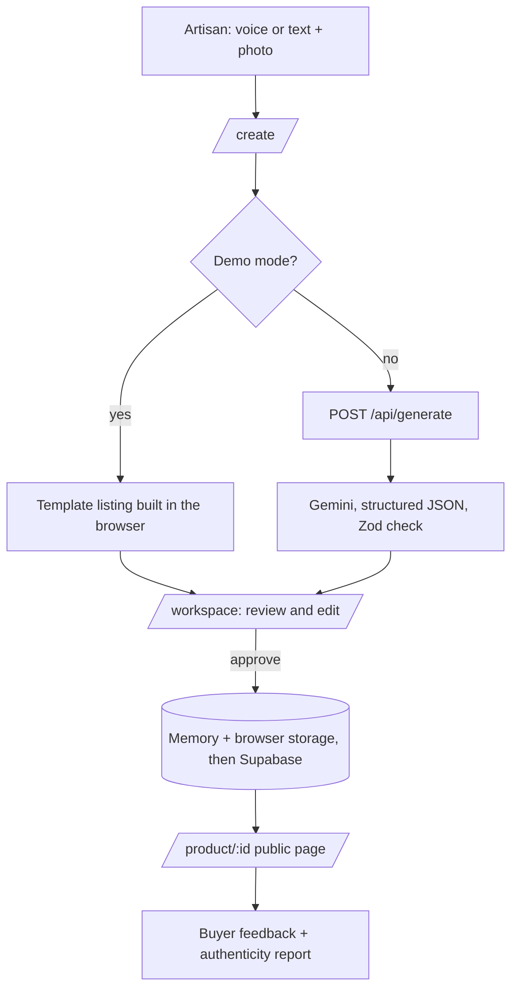

<div align="center">

# VISART

### An AI-assisted listing studio for craft artisans

Describe a handmade product by voice or text, add a photo, and get a listing draft with a price range, a story, Hindi and Kannada text, marketing copy and a shareable product page.


[](./LICENSE)

[Features](#features) · [Quick start](#quick-start) · [How it works](#how-it-works) · [Methodology](./METHODOLOGY.md) · [Security](#security) · [Status](#project-status)

**Live demo:** [visart-xi.vercel.app](https://visart-xi.vercel.app)

</div>

---

## About

Many traditional makers have good products but little time or digital fluency to photograph, describe, price and promote them. VISART takes a few facts (material, cost, time, place, special details) and a photo, and drafts everything a listing needs. The artisan reviews and edits it in a workspace, publishes it, and shares a product page that also carries a buyer feedback form.

**It runs with no setup.** By default it is in a *demo mode* that fills listings from templates in the browser, with no API keys and no database, so anyone can click through the whole flow. Real Gemini and Supabase services are switched on with environment variables. Because of that default, please read what the AI parts do and do not do in [METHODOLOGY.md](./METHODOLOGY.md): the price range, readiness scores and "authenticity report" are drafting aids, **not verification**.

## Table of contents

- [Features](#features)
- [Quick start](#quick-start)
- [Configuration](#configuration)
- [How it works](#how-it-works)
- [Tech stack](#tech-stack)
- [Project structure](#project-structure)
- [Security](#security)
- [Project status](#project-status)
- [Documentation](#documentation)
- [Contributing](#contributing)
- [License](#license)

## Features

| Feature | What it does |
| :--- | :--- |
| Create page | Voice or text input (browser speech recognition in English, Hindi or Kannada) and a photo upload |
| AI listing | Title, descriptions, category, material, technique, keywords and tags |
| Price guidance | A minimum, recommended and maximum price in rupees with short reasons |
| Story and translations | A short artisan story, and titles and descriptions in Hindi and Kannada |
| Marketing copy | Ready text for Instagram, WhatsApp and a short ad |
| Readiness scores | Photo, description, discoverability, pricing and marketing scores with three suggested actions |
| Workspace | Review and edit the draft, then approve it |
| Product page | Public page at `/product/:id` with read-aloud (browser text to speech) and a feedback form |
| Authenticity report | A model-written report with "how to spot a fake" tips. Text only, not a verification |
| Buyer feedback | Reviews with an authenticity rating and a risk flag |
| Admin CMS | `/admin` for products, reviews, artisans, customers, settings and activity |

## Quick start

**Prerequisites:** Node.js 18+ and npm.

```bash
git clone https://github.com/ArrinPaul/Visart.git
cd Visart
npm install
npm run dev          # http://localhost:3000
```

With no configuration the app starts in demo mode. To use real services, copy `.env.example` to `.env.local` and follow [Configuration](#configuration). Then run the Supabase SQL in `supabase/schema.sql` in your project's SQL editor.

Other scripts: `npm run build`, `npm run start`, `npm run lint`.

## Configuration

| Variable | Purpose |
| :--- | :--- |
| `NEXT_PUBLIC_VISART_DEMO_MODE` | Demo mode is **on unless this is exactly `false`**. Set `false` to use the real Gemini listing generation |
| `GEMINI_API_KEY` | Google Gemini key. Server only |
| `GEMINI_MODEL` | Optional preferred model, tried before the built-in fallback list |
| `NEXT_PUBLIC_SUPABASE_URL`, `NEXT_PUBLIC_SUPABASE_ANON_KEY` | Supabase project. Without them data stays in memory and browser storage |
| `NEXT_PUBLIC_SUPABASE_PUBLISHABLE_KEY` | Supabase publishable key |
| `NEXT_PUBLIC_SUPABASE_STORAGE_BUCKET` | Image bucket, for example `product-images` |

## How it works


```mermaid
flowchart TD
    A[Artisan: voice or text + photo] --> B[/create/]
    B --> C{Demo mode?}
    C -->|yes| D[Template listing built in the browser]
    C -->|no| E[POST /api/generate]
    E --> F[Gemini, structured JSON, Zod check]
    D --> G[/workspace: review and edit/]
    F --> G
    G -->|approve| H[(Memory + browser storage, then Supabase)]
    H --> I[/product/:id public page/]
    I --> J[Buyer feedback + authenticity report]
```

The app is one Next.js project: pages and components in `app/` and `components/`, route handlers in `app/api/`, and the AI and persistence logic in `lib/`. Writes go to memory and browser storage first and to Supabase afterwards, so the app keeps working without a database. The scoring rules, model fallbacks and the demo-mode formulas are in [METHODOLOGY.md](./METHODOLOGY.md).

## Tech stack

| Layer | Technology |
| :--- | :--- |
| Framework | Next.js 16 (App Router), React 19, TypeScript 5 |
| Styling | Tailwind CSS 4, Motion, Lucide icons |
| AI | Google Gemini through `@google/genai`, with a model fallback list |
| Validation | Zod 4 |
| Data and storage | Supabase (Postgres and Storage), with in-memory and browser fallbacks |
| Voice | Web Speech API for speech recognition and speech synthesis |

## Project structure

```
app/            pages (/, /create, /workspace, /product/[id], /admin) and app/api/ route handlers
components/     landing, create, workspace, product, admin, ui
lib/ai/         Gemini listing generation and authenticity analysis
lib/supabase/   products, feedback, admin data, storage
lib/audio/      speech recognition and text to speech
lib/frontend/   client-side generation and demo fallback
types/          shared TypeScript types
supabase/       schema.sql with tables, policies and the storage bucket
docs/           architecture, API, database, security and feature documentation
```

## Security

**Do not deploy this with real customer data as it is.** The repository documents these itself in [`docs/SECURITY.md`](./docs/SECURITY.md) and [`docs/TECHNICAL_DEBT.md`](./docs/TECHNICAL_DEBT.md). In summary:

- **The admin routes have no server-side authentication.** Anyone who can reach the server can read and change products, reviews, settings and customer leads.
- **The admin login is only a client-side check** with credentials written in the source, and the page starts in a signed-in state.
- **Supabase policies are fully open.** Every table policy and the image bucket policy allow public reads and writes, so the public anon key can modify data directly.
- **No rate limiting.** Anyone can call `/api/generate` and `/api/verify-authenticity` repeatedly and run up Gemini costs.
- **"Verified Buyer" is always shown**, because there are no orders to check.
- Review text is placed into model prompts without checks, and anyone can submit a review, so a product can be flagged or the classifier steered by a stranger.
- Image optimization is allowed for any remote host.

## Project status

A hackathon-style prototype. The create, edit, publish and view flow works in demo mode, and the production build succeeds (`npm run build`). `npm run lint` reports 0 errors and 68 warnings. Live Gemini and Supabase paths were not run when this README was written, because no keys were available.

Known limits, stated plainly:

- Demo mode is the default, so many outputs on a fresh deployment are templates.
- Authenticity reports, price ranges and readiness scores are not measured or verified. See [METHODOLOGY.md](./METHODOLOGY.md).
- Several admin dashboard figures (growth, latency, conversion) are fixed or random placeholder values.
- Review moderation, customer leads, the activity log and settings are not stored in the database.
- There are no automated tests and no CI.
- Hindi and Kannada text is machine-generated and has not been reviewed by native speakers.

## Documentation

- [METHODOLOGY.md](./METHODOLOGY.md): how listings, prices, scores and flags are produced
- [`docs/ARCHITECTURE.md`](./docs/ARCHITECTURE.md), [`docs/API.md`](./docs/API.md), [`docs/DATABASE.md`](./docs/DATABASE.md): structure, endpoints and schema
- [`docs/SECURITY.md`](./docs/SECURITY.md), [`docs/TECHNICAL_DEBT.md`](./docs/TECHNICAL_DEBT.md): findings and the fix list
- [`docs/features/`](./docs/features): one page per feature
- [`docs/adr/001-demo-mode-dual-persistence.md`](./docs/adr/001-demo-mode-dual-persistence.md): why persistence is layered

## Contributing

Contributions are welcome. Fork the repository, create a branch, make your change, and open a pull request with a short note on how you tested it. The most valuable first fixes are the security items above. Please do not commit `.env` files or keys.

## License

Released under the [MIT License](./LICENSE). Copyright (c) 2026 ArrinPaul.
