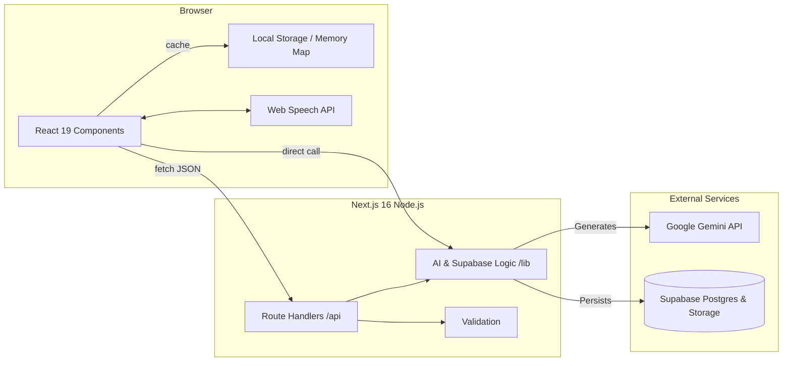
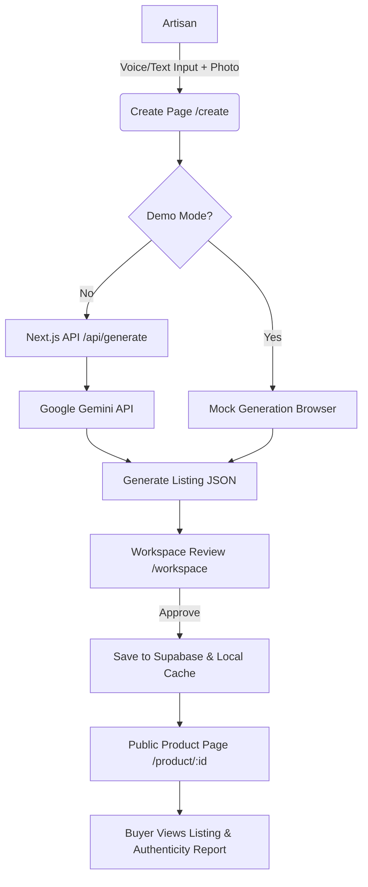
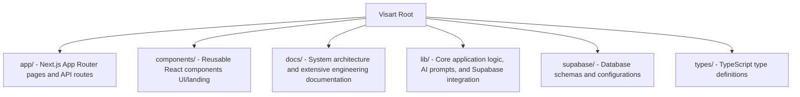

# VISART

VISART is an AI-assisted product listing studio tailored for craft artisans. It empowers traditional makers to effortlessly turn their handmade crafts into professional, market-ready digital stories with fair price guidance, multilingual reach, and shareable catalogue pages. By abstracting away the complexity of e-commerce, it gives artisans digital visibility without demanding digital fluency.

## Getting Started

### Prerequisites

- Node.js (>= 18.0.0 recommended)
- npm (Node Package Manager)

### Installation

1. Clone the repository to your local machine:
   ```bash
   git clone <repository-url>
   cd Visart
   ```
2. Install the project dependencies:
   ```bash
   npm install
   ```

### Running

The project can be run in different modes depending on your needs. The following scripts are available via `package.json`:

- **Development Server:**
  ```bash
  npm run dev
  ```
- **Production Build:**
  ```bash
  npm run build
  ```
- **Start Production Server:**
  ```bash
  npm run start
  ```
- **Lint Codebase:**
  ```bash
  npm run lint
  ```

### Environment Variables

To connect live Gemini and Supabase services, copy `.env.example` to a `.env.local` file and populate the following variables:

| Variable | Description |
|----------|-------------|
| `NEXT_PUBLIC_VISART_DEMO_MODE` | Demo Mode Flag (Set to "false" to connect live Gemini & Supabase) |
| `GEMINI_API_KEY` | Member B — Gemini API Key (Server Side Only) |
| `NEXT_PUBLIC_SUPABASE_URL` | Member C — Supabase Configuration (Project URL) |
| `NEXT_PUBLIC_SUPABASE_ANON_KEY` | Member C — Supabase Configuration (Anon Key) |
| `NEXT_PUBLIC_SUPABASE_PUBLISHABLE_KEY` | Member C — Supabase Configuration (Publishable Key) |
| `NEXT_PUBLIC_SUPABASE_STORAGE_BUCKET` | Member C — Supabase Configuration (Storage Bucket name, e.g. "product-images") |

## Tech Stack

The core frameworks and libraries used in this project include:
- **Framework:** Next.js (v16.2.12), React (v19.2.7)
- **Language:** TypeScript (v5.9.2)
- **Styling & Animations:** TailwindCSS (v4.3.3), Motion (v12.43.0), Lucide React
- **Validation:** Zod (v4.4.3)
- **AI Integration:** Google Gemini AI (`@google/genai`)
- **Database & Storage:** Supabase (`@supabase/supabase-js`)

## System Architecture & Workflow

VISART is built as a monolithic Next.js application leveraging Server Components and Route Handlers, with a unique dual-mode persistence architecture.

### System Architecture


```mermaid
flowchart LR
    subgraph Client [Browser]
        UI[React 19 Components]
        Local[Local Storage / Memory Map]
        Speech[Web Speech API]
    end
    
    subgraph Server [Next.js 16 Node.js]
        API[Route Handlers /api]
        Lib[AI & Supabase Logic /lib]
        Zod[Validation]
    end
    
    subgraph External [External Services]
        Gemini[Google Gemini API]
        Supabase[(Supabase Postgres & Storage)]
    end

    UI -->|fetch JSON| API
    UI -->|direct call| Lib
    UI -->|cache| Local
    UI <--> Speech
    API --> Zod
    API --> Lib
    Lib -->|Generates| Gemini
    Lib -->|Persists| Supabase
```

### User Workflow


```mermaid
flowchart TD
    A[Artisan] -->|Voice/Text Input + Photo| B(Create Page /create)
    B --> C{Demo Mode?}
    C -- Yes --> D[Mock Generation Browser]
    C -- No --> E[Next.js API /api/generate]
    E --> F[Google Gemini API]
    F --> G[Generate Listing JSON]
    D --> G
    G --> H[Workspace Review /workspace]
    H -->|Approve| I[Save to Supabase & Local Cache]
    I --> J[Public Product Page /product/:id]
    J --> K[Buyer Views Listing & Authenticity Report]
```

## Project Structure


```mermaid
graph TD
    Root[Visart Root]
    Root --> App[app/ - Next.js App Router pages and API routes]
    Root --> Components[components/ - Reusable React components UI/landing]
    Root --> Docs[docs/ - System architecture and extensive engineering documentation]
    Root --> Lib[lib/ - Core application logic, AI prompts, and Supabase integration]
    Root --> SupabaseDir[supabase/ - Database schemas and configurations]
    Root --> Types[types/ - TypeScript type definitions]
```

## Contributing

We welcome contributions! Please follow standard workflows:
1. Fork the repository.
2. Create a new branch (`git checkout -b feature/your-feature`).
3. Commit your changes (`git commit -m 'Add new feature'`).
4. Push to the branch (`git push origin feature/your-feature`).
5. Open a Pull Request for review.
