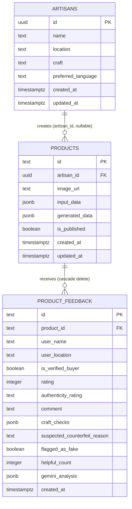

# Database

**Engine**: Supabase-managed PostgreSQL. **Schema source of truth**: [`supabase/schema.sql`](../supabase/schema.sql) — a single hand-maintained SQL file, no migration tool, no `supabase/migrations/` directory. Applying schema changes means running this file's statements manually against the Supabase SQL editor (or CLI) and remembering to update [`types/database.ts`](../types/database.ts) by hand afterward.

**Important caveat before reading further**: most of what the admin CMS displays (artisans list, customer leads, activity log, settings) is **not backed by this schema at all** — see the "What Actually Reaches Postgres" section below. Only `products` and `product_feedback` (and `artisans`, partially) are real tables that the app writes to.

## Tables

### [`artisans`](../supabase/schema.sql#L11)
| Column | Type | Notes |
|---|---|---|
| `id` | `uuid` PK | `gen_random_uuid()` default |
| `name` | `text` | not null |
| `location` | `text` | nullable |
| `craft` | `text` | nullable |
| `preferred_language` | `text` | default `'en'` |
| `created_at` | `timestamptz` | default `now()` |
| `updated_at` | `timestamptz` | default `now()` |

### [`products`](../supabase/schema.sql#L22)
| Column | Type | Notes |
|---|---|---|
| `id` | `text` PK | default `gen_random_uuid()::text` — a **text**, not uuid, PK; app code often supplies its own client-generated ID (`visart-<timestamp>-<random>`) instead of relying on the default |
| `artisan_id` | `uuid` FK → `artisans.id` | `on delete set null` |
| `image_url` | `text` | nullable — may hold a real Supabase Storage public URL, or a base64 `data:` URL when storage upload fails/is unconfigured (see [`lib/supabase/storage.ts:73`](../lib/supabase/storage.ts#L73)) |
| `input_data` | `jsonb` | not null, default `{}` — the raw artisan-supplied facts (`ProductInputData`) |
| `generated_data` | `jsonb` | default `{}` — the full AI generation output (`VisartGeneration`) |
| `is_published` | `boolean` | default `true` |
| `created_at` / `updated_at` | `timestamptz` | default `now()` |

Indexes: `idx_products_artisan_id`, `idx_products_created_at desc`.

### [`product_feedback`](../supabase/schema.sql#L89)
| Column | Type | Notes |
|---|---|---|
| `id` | `text` PK | app-generated (`fb-<timestamp>-<random>`), not a DB default |
| `product_id` | `text` FK → `products.id` | `on delete cascade` |
| `user_name` | `text` not null | unverified, client-supplied |
| `user_location` | `text` | nullable |
| `is_verified_buyer` | `boolean` | default `true` — **always sent as `true` by the app**, not derived from any purchase record (there is no order/purchase table in this schema at all) |
| `rating` | `integer` | check `1 <= rating <= 5` |
| `authenticity_rating` | `text` | check enum: `GENUINE_HANDCRAFTED`, `LIKELY_GENUINE`, `SUSPICIOUS_QUALITY`, `CONFIRMED_FAKE_REPLICA` |
| `comment` | `text` not null | no length constraint |
| `craft_checks` | `jsonb` | default `{}` |
| `suspected_counterfeit_reason` | `text` | nullable |
| `flagged_as_fake` | `boolean` | default `false` |
| `helpful_count` | `integer` | default `0` — no endpoint increments this |
| `gemini_analysis` | `jsonb` | default `{}` — the AI risk-classifier output |
| `created_at` | `timestamptz` | default `now()` |

Indexes: `idx_feedback_product_id`, `idx_feedback_created_at desc`.

There is **no `status` column** for review moderation (approved/flagged/rejected) — the admin CMS's moderation status (`ReviewModerationItem.status`) is computed client-side from `flagged_as_fake` plus a `localStorage` override map; moderation actions in `/admin` never update this table.

There is **no `users`, `customers`, `leads`, `orders`, `sessions`, or `settings` table.** Everything the admin CMS shows for artisans-directory metadata, customer leads, activity logs, and platform settings is either hardcoded seed data in `lib/supabase/admin.ts` or `localStorage`-only state.

## Entity-Relationship Diagram



## [Row Level Security](../supabase/schema.sql#L37)

RLS is **enabled** on all three tables, but every policy is fully permissive to anonymous requests:

```sql
-- artisans, products: public select/insert/update using (true) / with check (true)
-- product_feedback: public select/insert using (true) / with check (true)
```

**Practical effect**: the anon key shipped to the browser (`NEXT_PUBLIC_SUPABASE_ANON_KEY`) can read, insert, and update every row in `artisans` and `products`, and read/insert every row in `product_feedback`, directly from client-side JavaScript — bypassing the Next.js server entirely. There is no ownership concept (no `user_id` column, no auth-based policy) to restrict this. See [SECURITY.md](SECURITY.md).

No `delete` policy exists for any table via RLS, but the app's own [`DELETE /api/admin/products`](../app/api/admin/products/route.ts#L57) route uses the same anon-key client to delete rows — this only works because Supabase's default behavior without an explicit `delete` policy is to deny it, meaning **the admin "delete product" feature will fail against Postgres under RLS** as configured (it still "succeeds" from the UI's perspective because the `localStorage` copy is deleted regardless of whether the Supabase call succeeds — verify this in your own Supabase project before relying on delete-via-admin).

## [Storage](../supabase/schema.sql#L71)

Bucket: `product-images` (public). Policies: public `select`, public `insert`, public `update` on `storage.objects` for this bucket — again, anonymous, unauthenticated write access to a public bucket key from the client. Uploads are handled client-side in [`lib/supabase/storage.ts:13`](../lib/supabase/storage.ts#L13).

## How the App Actually Talks to the Database

Every read/write in [`lib/supabase/products.ts`](../lib/supabase/products.ts) (see [`saveProduct`](../lib/supabase/products.ts#L63), [`getProductById`](../lib/supabase/products.ts#L188)) and [`lib/supabase/feedback.ts`](../lib/supabase/feedback.ts) follows the same dual-path pattern:

1. Check an in-process `Map` (server) or `localStorage`/`sessionStorage` (browser) first.
2. If nothing found there, and `isSupabaseConfigured()` is true, query Supabase.
3. On write, always update the local cache; the Supabase write is best-effort (wrapped in try/catch, logged on failure, never thrown).

This means: with no Supabase project configured, the app is fully self-contained on seed data ([`lib/data/seed.ts`](../lib/data/seed.ts)) plus whatever the current browser tab or server process has created — nothing survives a server restart, and nothing is shared across browser tabs/devices. With Supabase configured, the app becomes eventually-consistent-ish between the local cache and Postgres, but reads still prefer the local cache, so a product created in one browser/server process is not guaranteed to be visible from another until the local cache is empty and the Supabase read path is hit.

## What Actually Reaches Postgres

| Admin CMS feature | Backed by Postgres? |
|---|---|
| Products list/create/edit/publish-toggle | Yes (`products` table), with the caveats above |
| Product delete | Attempted, likely blocked by RLS (no delete policy) |
| Buyer feedback | Yes (`product_feedback`) |
| Review moderation status | **No** — `localStorage` only |
| Artisans directory (verify/status) | **No** — seed data + `localStorage`/memory only; `artisans` table is only ever written to when a product is created with artisan info via `saveProduct`, never read back into the admin directory view |
| Customer leads/CRM | **No** — `localStorage` only, no table exists |
| Activity log | **No** — `localStorage` only, no table exists |
| Platform settings | **No** — `localStorage` only, no table exists |
| Dashboard "growth rates" / performance metrics | **No** — hardcoded/simulated values in `lib/supabase/admin.ts` |
