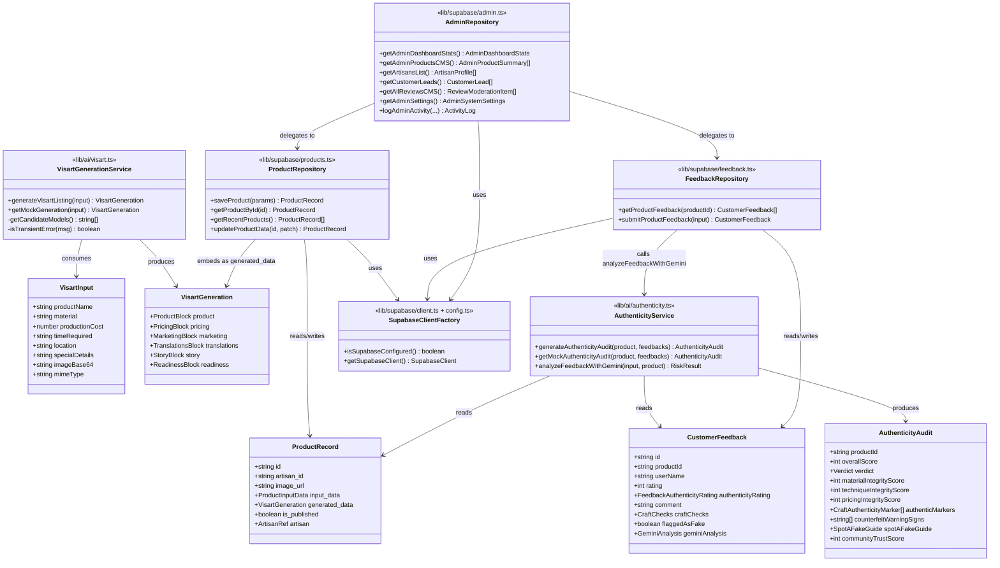

# Class Diagram (Architectural)

See [README.md](README.md) for how to read this — boxes are logical modules/types, not literal OOP classes.

Note: `AdminRepository` is named after its file ([`lib/supabase/admin.ts`](../../lib/supabase/admin.ts)) but, per [DATABASE.md](../DATABASE.md), most of its own domain data (artisans directory status, customer leads, activity log, settings) is `localStorage`-backed, not Supabase-backed — its dependency on `SupabaseClientFactory` above reflects only the parts it delegates to `ProductRepository`/`FeedbackRepository`.
