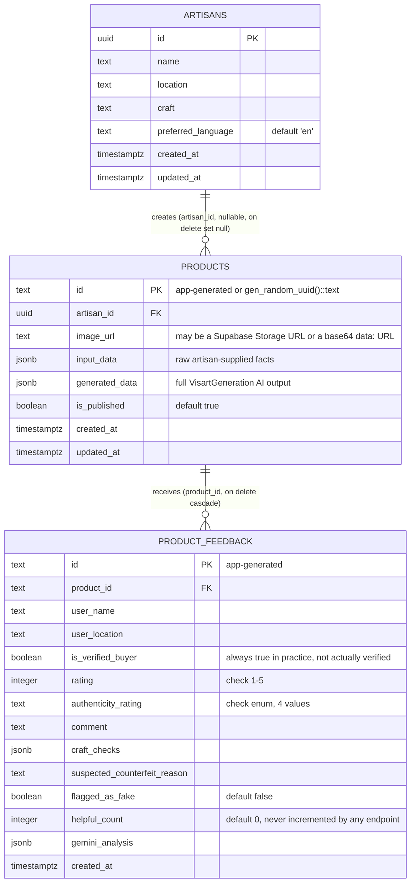

# Entity-Relationship Diagram

Canonical version of the diagram also shown in [DATABASE.md](../DATABASE.md). Reflects only the 3 tables that actually exist in [`supabase/schema.sql`](../../supabase/schema.sql) — see [DATABASE.md](../DATABASE.md#what-actually-reaches-postgres) for what admin-CMS-displayed data has *no* backing table at all (customers, activity log, settings, review moderation status).

**RLS**: all three tables have Row Level Security enabled with fully permissive (`using (true)` / `with check (true)`) public policies — see [SECURITY.md](../SECURITY.md) finding #3.
