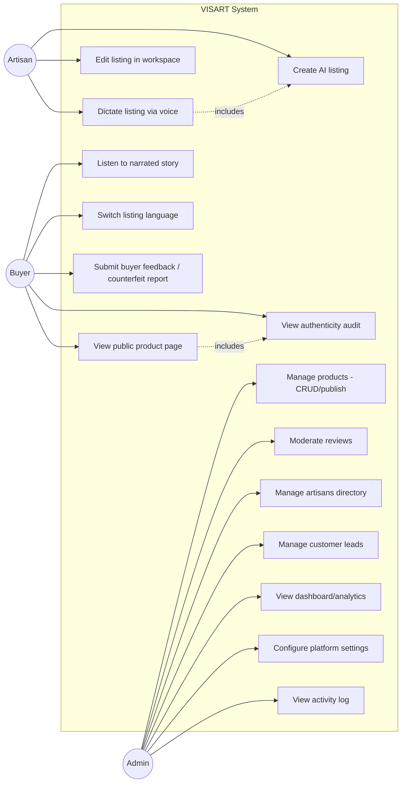

# Use Case Diagram

**Note on actors**: none of these are authenticated identities — see [AUTHENTICATION.md](../AUTHENTICATION.md). They represent roles-by-context (which page/flow someone is using), not accounts.

## Notes
- `UC2` (voice dictation) is an `includes` extension of `UC1` (create listing) — it's an alternate input method for the same form, not a separate flow.
- `UC7` (authenticity audit) is generated automatically as part of `UC4` (viewing a product) — there is no separate "request an audit" action; every page view regenerates it.
- Because the system boundary has no real authentication, in practice a single unauthenticated visitor can perform every use case above, including all `Admin` ones, by navigating to `/admin` directly — the actor separation here reflects the *intended* UI role separation, not an enforced one. See [SECURITY.md](../SECURITY.md).
